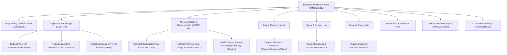

# ⚡ PROJECT REPORT: ELECTROVERSE — VIRTUAL ENGINEERING LABORATORY & SIMULATION SUITE

---

## 📌 PROJECT METADATA

- **Project Title**: ElectroVerse — Virtual Engineering Laboratory & Simulation Suite
- **Lead Developer / Author**: Souvik Kundu ([GitHub: @SOUVIK251](https://github.com/SOUVIK251))
- **Application Type**: Cross-Platform Offline Desktop CAD/CAE Engineering Suite
- **Technology Stack**: Python 3.8+, PySide6 (Qt6 GUI Framework), Matplotlib, PyQtGraph, NumPy, SciPy
- **Target Audience**: Electrical & Electronics Engineering (EEE/ECE/CSE) Students, Educators, and Hardware Researchers
- **License**: MIT Open Source License

---

## 📑 EXECUTIVE SUMMARY

**ElectroVerse** is an offline, laboratory-grade virtual engineering environment designed to bridge the gap between theoretical electrical engineering concepts and practical laboratory experimentation. Inspired by industry-standard software suites like **NI Multisim**, **Keysight BenchVue**, and **MATLAB App Designer**, ElectroVerse unifies digital logic design, 2D solderless breadboard simulation, virtual 8085 microprocessor assembly IDEs, real-time circuit transient solvers, and interactive signal processing visualizers into a single, high-performance offline desktop application.

By providing a 100% offline, hardware-accelerated simulation suite, ElectroVerse eliminates the requirement for costly physical laboratory equipment, components, power supplies, and breadboards while maintaining university-standard accuracy in logic state calculation, netlist propagation, assembly execution, and CBT assessment.

---

## 🎯 PROBLEM STATEMENT & PROJECT OBJECTIVES

### 1. Problem Statement
Traditional electronics engineering education faces several fundamental challenges:
- **High Equipment Costs & Availability**: Access to physical laboratory trainer kits, breadboards, TTL ICs, and microcontrollers is often limited by budget constraints or institution schedules.
- **Trial & Error Component Damage**: Beginners frequently damage components due to short circuits, incorrect power wiring (VCC/GND reversal), or open-collector floating outputs.
- **Offline & Connectivity Constraints**: Web-based simulation tools require steady internet connections and often lack deep, curriculum-aligned textbook derivations and CBT assessment suites.

### 2. Project Objectives
- **Standardized 5-Tab Hub Architecture**: Organize every major engineering discipline into 5 consistent learning pillars: **📖 Learn**, **🧠 Problem Solving Lab**, **🧪 Simulation/Practice**, **📝 Assessment**, and **📚 Reference**.
- **Physics & Logic Netlist Solver**: Develop a single-source-of-truth graph-traversal solver (`NetlistEngine`) that evaluates electrical connections, power rails (VCC/GND), and TTL IC logic transfer functions dynamically.
- **Virtual Assembly IDE**: Build a cycle-accurate Virtual Intel 8085A CPU Core supporting register array tracking, flag updates, opcode lookup, and memory inspection.
- **Comprehensive CBT Exam System**: Provide an offline Computer-Based Test (CBT) engine containing 3,600+ questions across 120 exam sets with Bloom's Taxonomy analytics, radar skill profiles, and QR-verifiable Certificates of Mastery.
- **Curriculum-Aligned Oral Prep**: Embed 2,200+ viva voce and interview questions featuring **"🧠 Instant Memorization Tricks"** to boost concept retention.

---

## 🏗️ SYSTEM ARCHITECTURE & DESIGN

ElectroVerse is built on a modular, decoupled event-driven architecture using **PySide6 (Qt6)** for hardware-accelerated GUI rendering, **Matplotlib/PyQtGraph** for plotting, and custom mathematical/logical calculation backends.



---

## 🔬 MODULE SPECIFICATIONS & TECHNICAL IMPLEMENTATION

### 1. ⚡ Digital System Design (DSD) Hub
- **2D Virtual Solderless Breadboard Trainer (`DSDLabView`)**: Full interactive canvas supporting drag-and-drop wire routing, DIP switches, LED indicators, output terminal panels, and 74-Series TTL IC packages (`7400 NAND, 7402 NOR, 7404 NOT, 7408 AND, 7411 3-Input AND, 7432 OR, 7486 XOR, 74266 XNOR`).
- **Netlist Graph Traversal (`NetlistEngine`)**: Builds electrical adjacency graphs from placed wires, validates VCC (Pin 14) and GND (Pin 7) power rails, and propagates logic levels across breadboard bus strips.
- **Wire-Driven IC 74266 XNOR Logic Engine**: Enforces strict wire-driven validation requiring both input pins (Pin 1 & Pin 2) to be connected to electrical nets before output evaluation, preventing premature output activation in unwired states.
- **Auto-Wire Replacement Logic**: Automatically removes duplicate/stale output wires when re-wiring output terminals to prevent multiple terminals from lighting up simultaneously.

### 2. 💻 Microprocessor & Microcontroller (MPMC) Hub
- **Virtual Intel 8085A CPU Core (`V8085CPU`)**: Simulates 8-bit accumulator (`A`), general registers (`B, C, D, E, H, L`), 16-bit Program Counter (`PC`), Stack Pointer (`SP`), and 5 status flags (`Sign, Zero, Auxiliary Carry, Parity, Carry`).
- **Interactive Assembly IDE & Keypad Kit**: Features a step-by-step assembly instruction execution engine, assembly editor, opcode lookup table, 64KB RAM memory table inspector (`0000H - FFFFH`), and pre-built experiment programs (*Arithmetic, Logical, Data Transfer, Bit Manipulation, BCD Operations, Array & String Operations*).
- **MPMC System Calculators (`MPMCEngine`)**: Provides numerical solvers for 16-bit Address Decoding ($A_0 - A_{15}$ chip select logic), ROM/RAM Memory Mapping, Interrupt Vector Address Calculation (RST 5.5, 6.5, 7.5, TRAP), Timer/Counter values, and UART Baud Rate generation.

### 3. 🌊 Analog Electronics Circuit Hub
- **Interactive Textbook & Derivations**: Step-by-step interactive derivation revealer for diode equation, clipper thresholds, clamper DC shifts, rectifier ripple factors, and filter cutoff frequencies.
- **Staged Matplotlib Waveform Visualizers**: Tailored visualizers displaying input vs. output waveforms, clipping thresholds ($V_{\text{clip}}$), DC shift levels ($V_{dc}$), rectifier DC levels, and Bode Magnitude/Phase plots.

### 4. 📈 Signal & System Hub
- **Signal Processing Visualizer Engine**: Real-time Matplotlib interactive generators supporting Continuous & Discrete Signals (Step, Ramp, Sine, Square, Triangular), Signal Operations (Time Shift, Time Scale, Time Fold), Linear Convolution Animator, Fourier Series Harmonics Synthesizer, Laplace & Z-Transform Pole-Zero & ROC Plotter, and Nyquist Sampling & Aliasing Demonstrator.

### 5. ⚡ Network Theory Hub
- **Virtual Engineering Laboratory Manuals**: 13-step learning loops (*Theory ➔ Recognition Decision Tree ➔ Memory Trick ➔ Flowchart Workflow ➔ Algorithm ➔ Worked Examples ➔ Interactive Solver ➔ Rule-Based Hints ➔ Simulation ➔ Practice ➔ Shortcuts ➔ Viva ➔ Summary*) covering Ohm's Law, KCL, KVL, Mesh/Nodal Analysis, Source Transformation, Thevenin/Norton Theorems, Maximum Power Transfer, Phasor Analysis, Resonance, and Passive Filters.

### 6. 📝 Enterprise Computer-Based Testing (CBT) Examination Engine
- **3,600-Question Database across 120 Exam Sets**: Supports 5 modes (*Easy, Medium, Hard, Mixed, Adaptive*).
- **Bloom's Taxonomy Categorization**: Questions categorized across 6 cognitive levels (*Remember, Understand, Apply, Analyze, Evaluate, Create*).
- **Analytics & Certificates**: Matplotlib response breakdown pie charts, topic mastery bar graphs, radar skill profiles, and QR-verifiable official Certificates of Mastery (PNG/PDF) for scores $\ge 80\%$.

---

## 🎨 DESIGN SYSTEM & LABORATORY THEME

ElectroVerse incorporates a high-contrast, clean laboratory theme designed for extended engineering study sessions:

| Theme Element | Hex Color Code | Function / Purpose |
| :--- | :--- | :--- |
| **Window Background** | `#0B1020` | Deep laboratory dark theme background |
| **Sidebar Panel** | `#111827` | Navigation sidebar with `#2563EB` active selection indicator |
| **Laboratory Cards** | `#141B2D` | Container cards with `#26334D` border and 10px rounded corners |
| **Primary Accent** | `#06B6D4` | Active tabs, highlights, links, focus borders |
| **Secondary Accent** | `#2563EB` | Primary action buttons (`#3B82F6` hover state) |
| **Success Status** | `#22C55E` | HIGH logic output, test passed, correct answer |
| **Error / Warning** | `#EF4444` / `#F59E0B` | OFF/Low state, error alert, unvisited item |

---

## 🧪 TESTING, VERIFICATION & QUALITY ASSURANCE

### 1. IC 74266 XNOR Gate 6-Test Suite Verification
To ensure 100% mathematical and logical correctness of the netlist propagation engine, the IC 74266 Quad 2-Input XNOR gate underwent rigorous automated testing:

```text
Test 1: No Wires Connected
  Input A = UNWIRED | Input B = UNWIRED → Y0: OFF (0V)           [PASS]

Test 2: Only Input A Connected (Input B Unwired)
  Input A = Connected | Input B = UNWIRED → Y0: OFF (0V)         [PASS]

Test 3: A=0, B=0 and Both Inputs Connected
  Input A = 0 | Input B = 0 → Y0: HIGH (5V) [ON]                 [PASS]

Test 4: A=0, B=1 and Both Inputs Connected
  Input A = 0 | Input B = 1 → Y0: OFF (0V)                       [PASS]

Test 5: A=1, B=0 and Both Inputs Connected
  Input A = 1 | Input B = 0 → Y0: OFF (0V)                       [PASS]

Test 6: A=1, B=1 and Both Inputs Connected
  Input A = 1 | Input B = 1 → Y0: HIGH (5V) [ON]                 [PASS]
```

---

## 📊 PROJECT IMPACT & CONCLUSION

### Conclusion
**ElectroVerse** successfully delivers an offline, hardware-accelerated desktop application that brings practical engineering laboratories into a software environment. By integrating interactive breadboard trainers, assembly IDEs, rule-based solvers, and CBT examination engines, ElectroVerse empowers students and educators with a self-contained learning laboratory.

### Future Enhancements
1. **Extended Microcontroller Architectures**: Integrate 8051 assembly compiler and ARM Cortex-M instruction cycle simulator.
2. **PCB Layout & Schematic Export**: Add automated netlist export to Industry-Standard KiCAD / SPICE netlist formats.
3. **Advanced DSP Signal Filters**: Incorporate FIR/IIR digital filter design tab with Pole-Zero placement.

---

> **Project Repository**: [https://github.com/SOUVIK251/Electroverse](https://github.com/SOUVIK251/Electroverse)  
> **Lead Developer**: Souvik Kundu ([@SOUVIK251](https://github.com/SOUVIK251))
